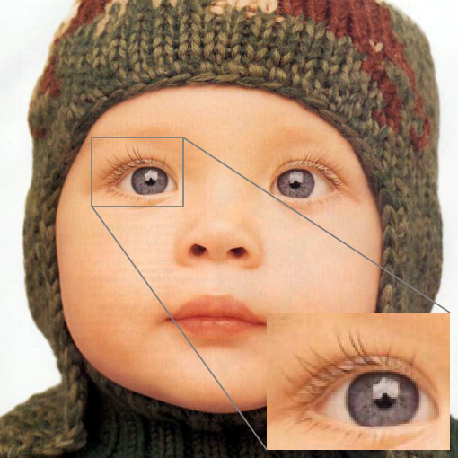
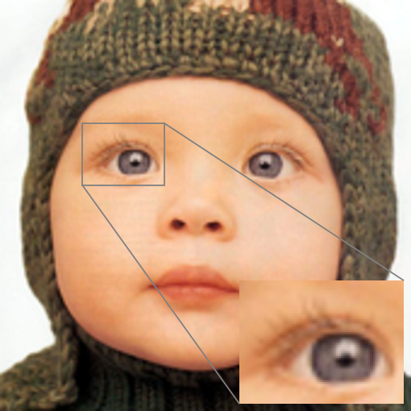

# Fast-super-resolution-by-CNN

Reimplementation of https://arxiv.org/abs/1608.00367 in Tensorflow 2.1. 

## Changes from original author
  * Used Adam as the optimizer instead of SGD

## Results
Original                   | Bicubic                   | FSRCNN (with Adam)
:-------------------------:|:-------------------------:|:-------------------------:
   |   | 

Original                   | Bicubic                   | FSRCNN (with Adam)
:-------------------------:|:-------------------------:|:-------------------------:
   |   | 
