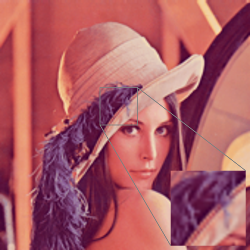

# Fast-super-resolution-by-CNN

Reimplementation of https://arxiv.org/abs/1608.00367 in Tensorflow 2.1. 

## Changes
  * Used Adam as the optimizer instead of SGD

## Prepare the data
For the 91-image dataset
```
python extract_patches.py -path "dataset/T91" -output_path "T91_x3.h5" -f_sub_lr 7 -upscaling 3
```

For the validation dataset (20 random images from BSD500)
```
python extract_patches.py -path "dataset/BSD500_val_20" -output_path "BSD500_x3.h5" -f_sub_lr 7 -upscaling 3
```


## Training
To train from scratch 
```
python run.py -epochs 15 [-include_test] -train_path "T91_x3.h5" -val_path "BSD500_x3.h5" -f_sub_lr 7 -upscaling 3 -batch_size 128
```
To resume training (pretrained weights for upscaling factor of 3 and 4 are included in weights_x3 and weights_x4)
```
python run.py -epochs 15 -continue -weights weights_x3 [-include_test] -train_path "T91_x3.h5" -val_path "BSD500_x3.h5" -f_sub_lr 7 -upscaling 3 -batch_size 128 
```


## Results

| Test dataset        | upscaling factor | bicubic | FSRCNN (Dong et al.)  | FSRCNN (Our with Adam)  |
| ------------- |:-------------:|-------------:|-------------:| -----:|
| Set5      | 3 | 30.91 | 33.06 | **33.79** |
| Set14     | 3 | 27.91 | 29.37 | **29.85** |
| BSD200    | 3 | 27.70 | 28.55 | **29.14** |
| ------------- |:-------------:|-------------:|-------------:| -----:|
| Set5      | 4 | 28.47 | **30.55** | 29.75 |
| Set14     | 4 | 25.99 | **27.50** | 26.91 |
| BSD200    | 4 | 26.66 | 26.92 | **27.37** |

### Images
Original                   | Bicubic                   | FSRCNN (with Adam)
:-------------------------:|:-------------------------:|:-------------------------:
   |   | 

Original                   | Bicubic                   | FSRCNN (with Adam)
:-------------------------:|:-------------------------:|:-------------------------:
   |   | 
